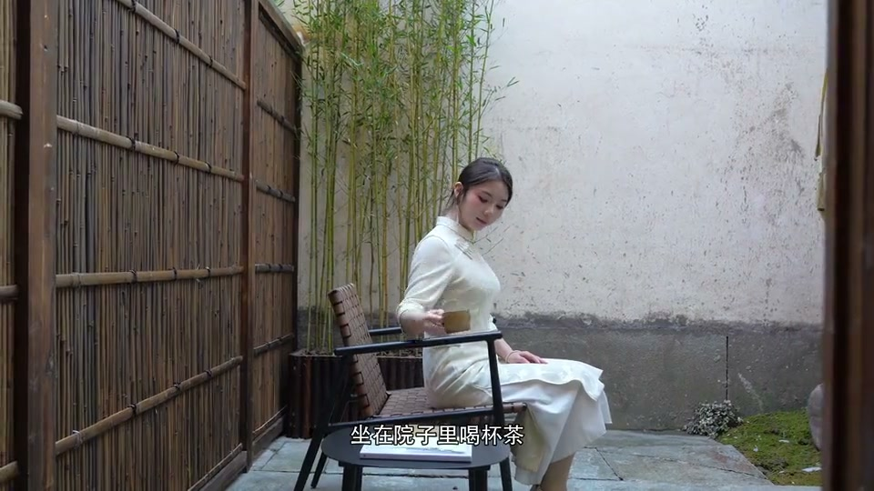
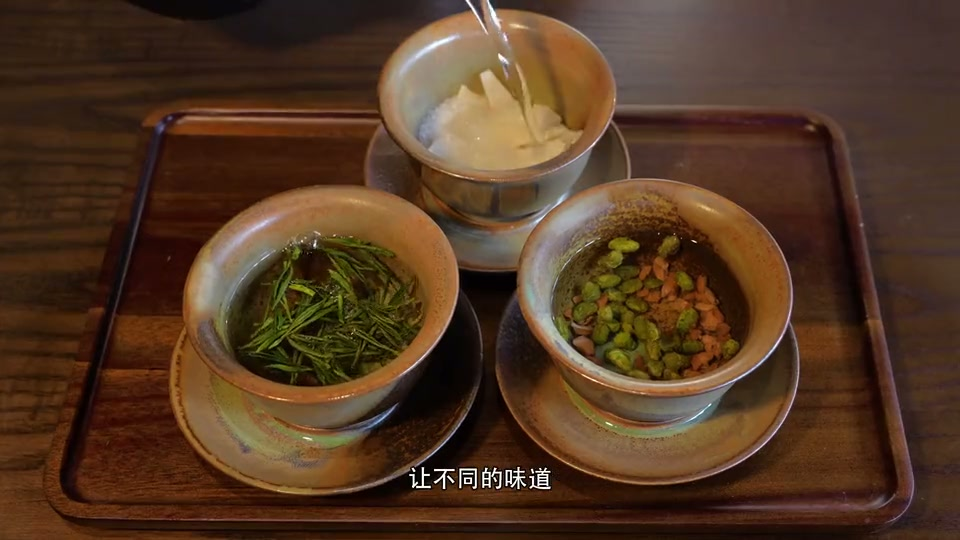

# ShotAI 商家短视频

[English](README.md) · [下载 ShotAI 客户端](https://www.shotai.io) · [中文技能包](dist/shotai-business-video-zh.zip) · [English skill package](dist/shotai-business-video-en.zip)

把固定文案和自己的素材，制作成带配音、字幕与配乐的抖音/TikTok信息流视频。适合有自有素材的餐厅、咖啡馆、民宿、酒店及本地店铺小老板。

**必须先下载 ShotAI 客户端，再把素材入库并完成索引。** 本技能不提供素材库；ShotAI MCP 只能找到已经导入 ShotAI、完成分析和索引的视频。只安装技能、只把文件放在硬盘或只提供文件夹路径，都不能让素材自动变得可搜索。

## 实际制作案例

以下为用户已完成的南浔民宿视频，也是本技能提炼所依据的实作案例。两条均为 **中文 Serena 旁白、16:9横屏**，不作为英文或竖屏演示。点击下方封面可打开对应MP4文件，也可通过视频链接下载。

### 1. 把周末留给休息

**58.57秒 · 38镜 · 每镜1–2秒。** 都市上班族的周末放松视角，配轻柔吉他。

[打开MP4](docs/examples/weekend-reset.mp4) · [下载MP4](https://raw.githubusercontent.com/abu-ShotAI/shotai-business-video/main/docs/examples/weekend-reset.mp4) · [封面](docs/examples/weekend-reset.jpg)

配乐：**Clear Air — Kevin MacLeod**（[官方来源](https://incompetech.com/music/royalty-free/index.html?isrc=USUAN1100626)），按 [CC BY 4.0](https://creativecommons.org/licenses/by/4.0/) 使用；进行了节选、淡入淡出、音量调整与旁白混音。

### 2. 把住处也当作旅程

**68.93秒 · 44镜 · 每镜1–2秒。** 慢旅行者关注空间、早餐和茶饮的视角，已优化首句节奏并加入轻柔钢琴。

[打开MP4](docs/examples/slow-stay-details.mp4) · [下载MP4](https://raw.githubusercontent.com/abu-ShotAI/shotai-business-video/main/docs/examples/slow-stay-details.mp4) · [封面](docs/examples/slow-stay-details.jpg)

配乐：**Meditation Impromptu 01 — Kevin MacLeod**（[官方来源](https://incompetech.com/music/royalty-free/index.html?isrc=USUAN1100163)），按 [CC BY 4.0](https://creativecommons.org/licenses/by/4.0/) 使用；进行了节选、淡入淡出、音量调整与旁白混音。

案例沿用已入库ShotAI素材的既有选镜记录，第二条开头两镜在修订时重新通过实时MCP检索和导出，制作先于技能工具打包。网页提供1080p原片的960×540预览副本，声音和时长保留。**视频与封面经用户授权展示，不自动适用代码的MIT许可。** [制作信息与素材署名](docs/examples/CREDITS.md)。

## 第一次使用：先准备素材库

1. **从 [ShotAI 官网](https://www.shotai.io) 下载、安装并打开客户端。**
2. **为本店或当前分店创建集合。** 不同店铺、不同住宿项目的素材分开管理，避免混用设施和菜品。
3. **导入有权使用的视频文件或文件夹。** 建议准备门头、菜品/客房、设施、细节和真实服务动作。
4. **等待镜头分析与语义索引完成。** 索引未完成时，搜索可能找不到已导入的视频。
5. **在客户端中启用/配置 MCP，再连接你的 AI 助手。** 按当前安装版本的实际设置操作；检索和导出期间保持客户端与本地 MCP 服务可用。
6. **先验证一次。** 让助手列出集合，选中本店，再搜索“客人在庭院喝茶”之类具体画面。确认返回的是自己的素材后再制作成片。

如果搜不到，先检查客户端/服务是否运行、集合是否选对、素材是否入库、索引是否完成。尚未入库的文件不会因为多换几个关键词就出现。详见 [MCP接入说明](references/shotai-mcp.md)。

## 安装技能

下载 [中文包](dist/shotai-business-video-zh.zip) 或 [英文包](dist/shotai-business-video-en.zip)，解压后把 shotai-business-video 目录放入技能目录。Codex通常为 ~/.codex/skills/。新会话调用 $shotai-business-video。

两个包是同一技能的不同入口语言，功能与名称相同，选择一个安装即可，不必重复安装。两者都能分别生成中文视频和英文视频。

## 直接这样说

> 用 $shotai-business-video，把这份固定文案和 ShotAI 里的本店素材做成60秒竖屏抖音视频。先给我两个中文音色试听，配乐选轻柔纯音乐。文案和套餐价格不要改。

> 给我的民宿各做一条中文版和英文版，分别用于抖音和TikTok。只用指定集合；中文沿用上次音色，英文给两个声音让我选。配乐用我提供的已授权钢琴。

店主提供文案、集合和偏好，助手负责内部时间线、素材对应及制作记录，不要求手填技术表单。

## 能完成什么

- **固定文案**：保留原文、价格和事实，理解角色视角、痛点和需求。
- **实时选材**：通过 ShotAI MCP 按语义检索，核对画面，再导出真实片段。
- **自选配音**：先试听，再生成完整旁白；支持自有录音，中文英文分别制作。
- **字幕与剪辑**：按真实语音定时，通常1–2秒一镜，逐镜检查竖屏裁切。
- **自选配乐**：检查商业同步使用范围，人声优先、讲话时压低音乐、首尾渐变。
- **成片交付**：MP4、SRT、署名和制作记录，并可恢复地清理临时文件。

默认1080×1920、30fps，通常35–80秒；固定文案优先，不为凑时长擅自删句。技能不自动发布账号内容，也不创建广告投放。

## 使用条件

需要已入库并索引的 ShotAI 素材、可用 MCP、Python 3.10+、FFmpeg/FFprobe、[Python依赖](requirements.txt)和字体。词时间戳来自可用TTS或ASR服务/本地模型，包内不含ASR模型。

内置Edge、Qwen官方公共演示和本地录音接口；其他生产TTS按文档接入。演示服务存在配额，音色与音乐的使用条款仍需按实际场景确认。抖音/TikTok、自然发布与付费广告的音乐授权不能默认互通。

ShotAI负责检索和片段导出，本地FFmpeg/Pillow负责最终画面、字幕和音频合成。只改配乐时保留原视频码流。详细说明：[安装](references/setup.md) · [中文流程](references/workflow.zh.md) · [声音与配乐](references/voice-music.md)。

## 验证与许可

已完成模拟MCP、合成音视频、中英字幕渲染、混音和独立场景检查，范围见 [验证说明](docs/validation.md)。不将离线测试等同所有线上服务可用。

技能脚本和文档采用 [MIT](LICENSE)，展示视频与封面不在该授权范围内，见 [案例使用说明](docs/examples/CREDITS.md)。客户端、服务、音乐、字体及视频素材各自遵循其许可。技能安装ZIP不含个人素材、凭据或音乐；仓库案例视频独立展示并附配乐署名。
